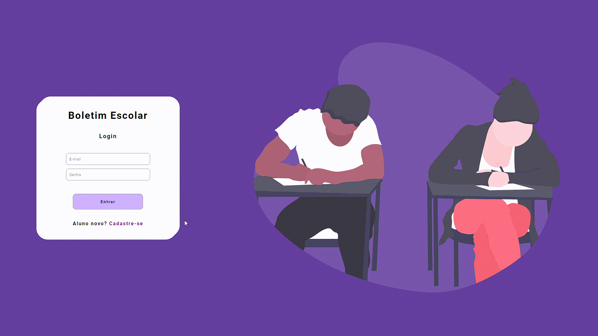

# **Boletim Escolar**

- ### Para testar minhas skills, que venho aprendendo no Curso ProgramadorBR, tive a ideia de fazer um sistema de boletim escolar, utlizando:

 - **HTML**
- **CSS**
- **JAVASCRIPT**
- **Firebase(_Auth e Firestore_)**
---

 ### - Esse projeto me desafiou bastante e me fez colocar na prática alguns dos conhecimentos aprendidos.Também me fez passar algumas horas travado em bugs, mas no final deu certo hahaha!!
## - Para acessar meu projeto na WEB [Clique aqui](https://project-boletim-escolar.netlify.app/) 

---

 # **Como funciona o sistema?**
  
- ### O sistema tem dois tipos de perfis, o perfil do **Professor** e os dos **Alunos**.
- ### Também possui "Dark-Mode", que quando ativado permanece salvo no LocalStorage do seu navegador
---
## Uma breve apresentação do perfil do professor e suas funcionalidades:

---
## Uma breve apresentação do perfil de um aluno e suas funcionalidades:

---
## Exemplo na versão mobile:

# **Perfil do Professor:**
- ## O **perfil do professor é unico**, e para acessar ele, utlize:

###  - **Email:** admprof@escolasp.com
### - **Senha:** 121212
---
 - ###  Com esse perfil você poderá modificar notas, faltas e ocorrências dos alunos, que já tenha cadastro. Basta buscar pelo **Nome do aluno e sua turma.**

- ## No sistema já terá alguns alunos criados, cujo eles são:

 ### **Nome do aluno: Anastacio**
### **Turma: 3ºA**
---
### **Nome do aluno: José**
### **Turma: 1ºB**
---
### **Nome do aluno: Ana**
### **Turma: 2ºC**

---
# **Perfil do Aluno:**

O perfil do aluno, é um perfil que apenas permitirá o usuário ver suas informações, então o aluno verá suas notas, suas faltas e ocorrências.Mas não poderá modificá-las

# **Como se registrar?**

Como podemos ver, no sistema já existe alguns alunos criados e você pode entrar como um desses alunos, basta utilizar seu email e senha correspondente a cada aluno:

 ### **Aluno:** Anastacio
 ### **Email:** anastacio@escolasp.com
 ### **Senha:** 121212
 ---
  ### **Aluno:** Ana
 ### **Email:** ana@escolasp.com
 ### **Senha:** 202020
 ---
  ### **Aluno:** José
 ### **Email:** jose@escolasp.com
 ### **Senha:** 454545
---

### **Mas você pode criar o seu  proprio perfil de aluno, basta clicar em "Cadastrar-se" e preencher as informações pedidas.**

---
### Depois, de preenchar e aparecer a mensagem a "deu certo o cadastro", clique em "voltar" e seu faça seu login, com o Email e senha que foi criado!!

### **PRONTOO!, agora você é um aluno** Seja bem vindo aluno novo!!

---
## **observações:** *como o seu perfil é um perfil novo, as informações de notas, faltas e ocorrencias apareceram VAZIAS, para adicionar. Basta logar com o perfil de professor, buscar seu nome e sua turma e alterar notas, faltas e ocorrencias!!*

---